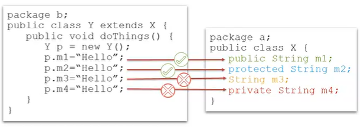
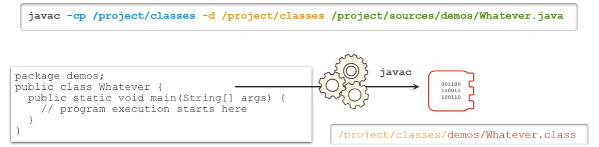
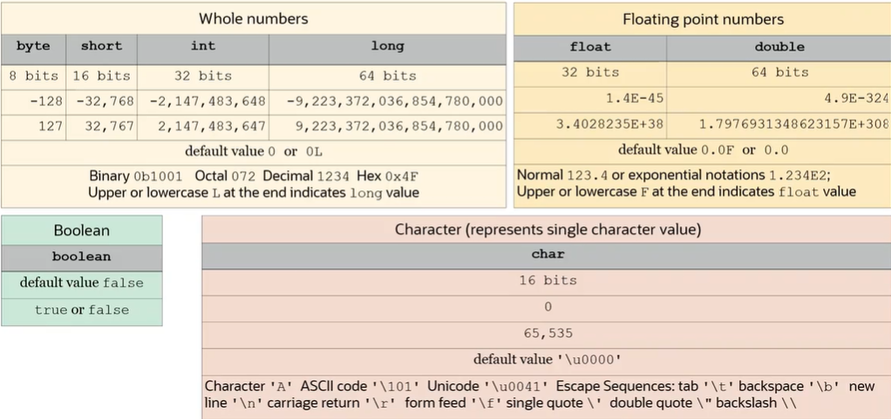
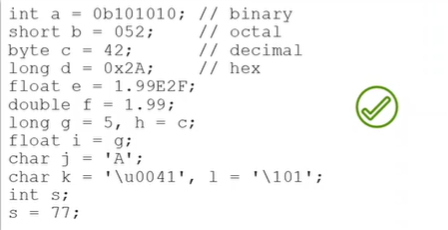

# JAVA-SE-17-certif-oracle

## Object Oriented Paradigm:

- There are four principles of the object-oriented paradigm, and these principles are:

 - **Abstraction**.
 - **Encapsulation**.
 - **Inheritance**.
 - **Polymorphism**.

### Abstraction:

- Abstraction helps to create a simplified but relevant view of a real-world object within the context of the problem and the solution.

### Encapsulation:

- Encapsulation is an essential property of an object. It's a mechanism by which some information of an object is hidden, determining how the information of an object can be modified or used.

### Inheritance:

- Inheritance defines relationships among classes, and a subclass object is represented as a kind of superclass object. It is important to mention that in **Java**, every class created descends from __java.lang.Object__ and implements its methods.

### Polymorphism:
- Polymorphism is a concept where a variable of declared type T can be assigned different types of objects at runtime, provided they are subtypes of the variable's type T.

## Java:

### Definition:
- Java is an object-oriented programming language similar to C and C++, which is platform-independent, meaning that it can be **run anywhere** (__"write once, run everywhere"__).

### How it works?
- Contrary to its counterpart **C**, **Java** can run everywhere. So, if we compile a C program on a certain OS, it can only be executed on that specific OS. In contrast, Java can be compiled by the executable __**javac**__ into a __.class__ file format, that is a bytecode file, which can then be run on any platform by the **JVM**.

### What are classes?
- A class is a blueprint for creating or instantiating objects. It contains attributes (information) and methods (algorithms) which are characteristics of those objects.
**N.B**: Java code is always structured and written inside classes.

### What are objects?
- An object is a specific instance of a class. In fact, object attributes are capable of holding specific values, and objects can also have behaviors (methods) defined by a class that represents their type.

### Inheritance in Java:
- A class can reuse attributes and methods of other classes across a class hierarchy. By forming a hierarchical relationship, a superclass serves as a more generic or parent type, defining common attributes and behaviors. In contrast, subclasses are more specific child types.

- There can be multiple levels in the hierarchy, from generic to specific child types. A subclass inherits all attributes and behaviors from its parent class and can define additional attributes and behaviors within itself.

**NB**: In **Java**, we use the keyword **extends** to create inheritencr relationship.

### Java naming convention:

### Access modifiers:
- Access modifiers describes visibility of classes, variables and methods, and in this part, we will see 4 access modifiers :

 - **`public`** : Visible in any class.
 - **`protected`** : Visible to the classes that are in the same package or to subclasses.
 - **`<default>`** : Visible to the classes that are in the same package and there is no access modifier set.
 - **`private`** : Visible only within the same class.

### Compiling Java program :
- Java classes can be compile with the executable **javac** with the folowing parameters :
 - The **-classpath** or **-cp** parameter points to locations of other classes that may be required to compile your code.
 - The **-d** parameter points to a path to store compilation result.
 - Provide paths of the classes that you generated source code.

### Execute Java program :
- After compiling, you can execute a java program with the executable **java** with the folowing parameters :
 - The **-classpath** or **-cp** parameter points to locations of where the **.class** files are located.
 - The **`<package_name.class_name>`** parameter indicate the executed class.
 - And provide a space separated list of parameters after the class name.

 

- from Java 11, we can directly compile and execute a **.java** class if only it doesn't need any other class that you wrote :
 
 

### Create a JavaDoc :
- You can create Java Documentation with commenting on the top of a bloc(**function**, **class**) :

 - **`comment:`** /**
                    * your description
                    * @athor name
                    * @version 1.0
                    */

- And after generate documentation with the executable **javadoc** :

 - **`javadoc -d <where_create_out> lists_of_fils_to_documents`**

 ### Java primitives types :
 - Java provides 8 primitives types :

  

### Declare and initialize primitives variables :
- Declare a variable of any type we use the syntaxe :
    <type_name> <variable_name> ;
- Declare and initialize a variable of any type we use the syntaxe :
    <type_name> <variable_name> = <value> ;

 - So, a variable can be initialized with no immediate initialization, so long as it is initialized before use.
 - Numeric values can be expressed as binary (**0B...**), octal (**0..**), decimal and hex (**0x..**).
 - Float or Double can be expressed in normal or exponential notations.
 - Multiple variables of the same type can be declared and initialized in the same time.
 - Smaller types are automatically promoted to bigger type.
 - Character values must be enclosed in sigle quotation marks.

  
 