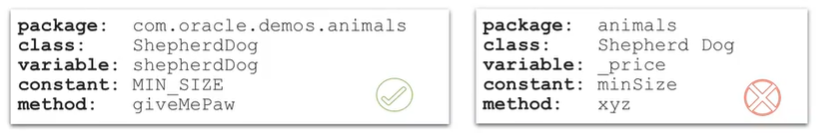

# JAVA-SE-17-certif-oracle

## Object Oriented Paradigm:

- There are four principles of the object-oriented paradigm, and these principles are:

 - **Abstraction**.
 - **Encapsulation**.
 - **Inheritance**.
 - **Polymorphism**.

### Abstraction:

- Abstraction helps to create a simplified but relevant view of a real-world object within the context of the problem and the solution.

### Encapsulation:

- Encapsulation is an essential property of an object. It's a mechanism by which some information of an object is hidden, determining how the information of an object can be modified or used.

### Inheritance:

- Inheritance defines relationships among classes, and a subclass object is represented as a kind of superclass object. It is important to mention that in **Java**, every class created descends from __java.lang.Object__ and implements its methods.

### Polymorphism:
- Polymorphism is a concept where a variable of declared type T can be assigned different types of objects at runtime, provided they are subtypes of the variable's type T.

## Java:

### Definition:
- Java is an object-oriented programming language similar to C and C++, which is platform-independent, meaning that it can be **run anywhere** (__"write once, run everywhere"__).

### How it works?
- Contrary to its counterpart **C**, **Java** can run everywhere. So, if we compile a C program on a certain OS, it can only be executed on that specific OS. In contrast, Java can be compiled by the executable __**javac**__ into a __.class__ file format, that is a bytecode file, which can then be run on any platform by the **JVM**.

### What are classes?
- A class is a blueprint for creating or instantiating objects. It contains attributes (information) and methods (algorithms) which are characteristics of those objects.
**N.B**: Java code is always structured and written inside classes.

### What are objects?
- An object is a specific instance of a class. In fact, object attributes are capable of holding specific values, and objects can also have behaviors (methods) defined by a class that represents their type.

### Inheritance in Java:
- A class can reuse attributes and methods of other classes across a class hierarchy. By forming a hierarchical relationship, a superclass serves as a more generic or parent type, defining common attributes and behaviors. In contrast, subclasses are more specific child types.

- There can be multiple levels in the hierarchy, from generic to specific child types. A subclass inherits all attributes and behaviors from its parent class and can define additional attributes and behaviors within itself.

**NB**: In **Java**, we use the keyword **extends** to create inheritencr relationship.

### Java naming convention:

### Access modifiers:
- Access modifiers describes visibility of classes, variables and methods, and in this part, we will see 4 access modifiers :

 - **public** : Visible in any class.
 - **protected** : Visible to the classes that are in the same package or to subclasses.
 - **`<default>`** : Visible to the classes that are in the same package.
 - **private** : Visible only within the same class.